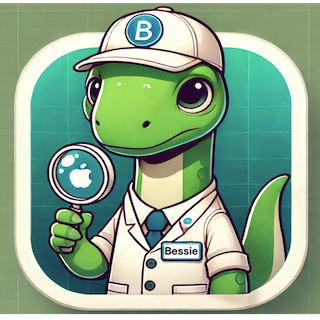
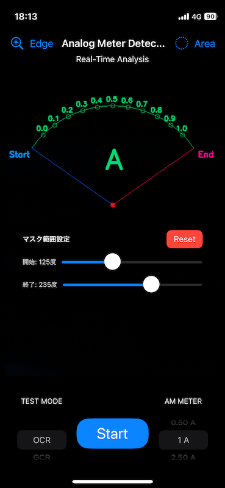
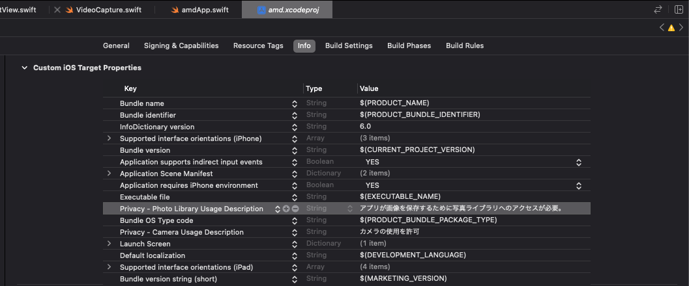
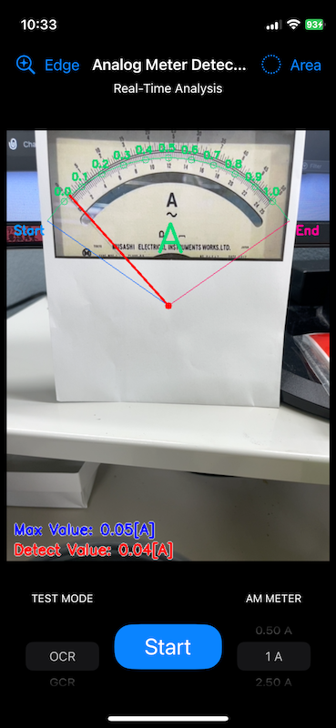
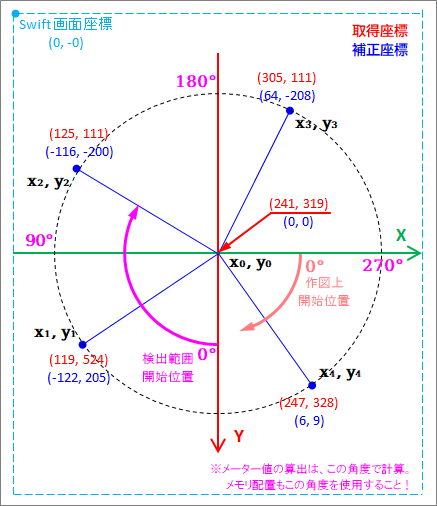
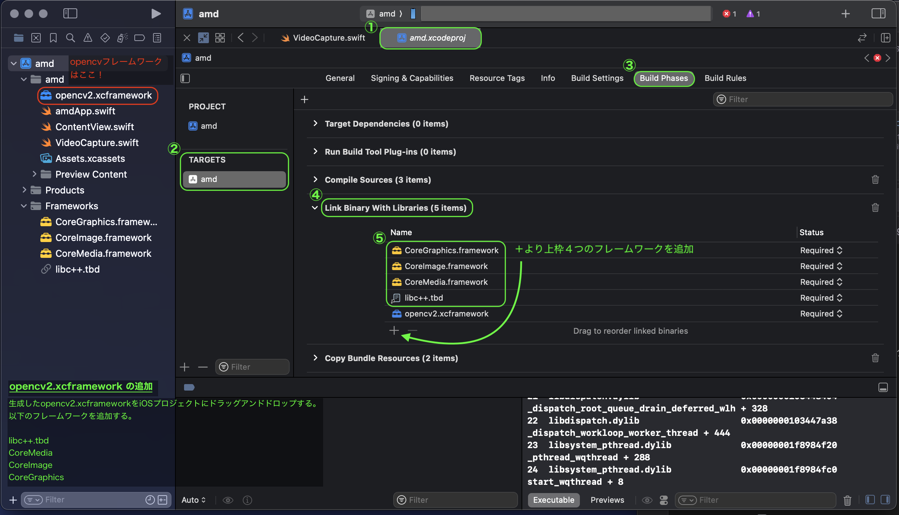

# analog_metor_detection

## 概要:
`analog_metor_detection` は、iPhoneでOpenCVを使用してアナログメーターを検出するツールです。  
このアプリは、円形メーターの目盛りの値と角度を設定し、メーター針を検出してその値を読み取ります。

## 特徴:
- メーター値のリアルタイム検出。
- ピーク値をマーク後、一定値以下現象でトリップ時の値をカメラロールへ保存。

## Appアイコン:



## 必要スペック:
- **OS:** iOS 17.4以上
- **デバイス:** iPhone Xs以降
- **メモリ:** 1GB RAM以上推奨
- **ストレージ:** 50MB以上の空き容量推奨（アプリのアップデートやキャッシュ用の余裕を考慮）

## バージョン:

|Update|Branch|Details|
|:--|:--|:--|
|2024/09/25|main|BS仕様|

---

## 更新履歴:

### 2024/09/24

#### <u>画面を実作業用へ修正</u>:

- 画面構成
    - 操作ボタンで機器(左下)・計測レンジ(右下)の切り替えを行う。機器は名称のみ、内容は未実装。
    - 設定を上部(左はエッジ検出設定、右は検出範囲設定)へ移動
    - 機器と使用レンジはキャプチャ中の処理低減対策兼、測定中の変更対策のため、停止時のみ選択可能。
    - 値の読取は計測レンジ(右下)より角度に対する値を冠山して行う。
    - 読取値は現在値と最大値を表示、最大値はSTART/STOPボタンのキャプチャ時に更新。
    - 最大値はチャプチャ停止時にリセットする。



- 設定追加<br>
**Privacy - Photo Library Usage Description** : Appの写真ライブラリへのアクセス



- エッジ検出テスト: 最大値マーク後、検出値が指定値より下がった時にキャプチャを写真ライブラリへ保存。



-> 最大値検出〜確認、トリップ時判定
```swift
                // 最大値更新時
                if value > maxVal {
                    maxVal = value
                    // Debug:検出値及び最大値
                    print(String(format: "Max Value: %.2f[A], Detect Value: %.2f[A]", maxVal, value))

                    // タイマーを開始し、値を一定時間(withTimeInterval[s])キープ後に次の条件を満たしたら保存する
                    if captureTimer == nil {
                        captureTimer = Timer.scheduledTimer(withTimeInterval: 1.5, repeats: false) { _ in
                            self.isCapturingImage = true
                            capturedMat = mat // 画面のキャプチャを保持
                            print(String(format: "キャプチャ画像保存の準備ができました: %.2f[A]", maxVal))
                        }
                    }
                }

                // 一定時間後、指定の条件を満たした時に画像を保存する
                if isCapturingImage && value < maxVal * 0.8 { // (仮)maxVal の80%以下になった場合
                    print("キャプチャ映像条件:True, value ->", value)

                    // capturedMat が nil でないことを確認してから画像を保存
                    if let capturedImage = capturedMat {
                        captureAndSaveImage(mat: capturedImage, selectedMode: selectedMode, selectedAmpere: selectedAmpere)
                    }

                    // タイマーとフラグをリセット
                    captureTimer?.invalidate()
                    captureTimer = nil
                    isCapturingImage = false
                }
```

#### <u>画面の構成(マスク範囲の開始位置など)を修正</u>:



#### 測定角度算出部分:

```swift
 // 最も長い直線が見つかった場合
if let (startPoint, endPoint) = longestLine {
    let deltaX = Double(startPoint.x - center.x)
    let deltaY = Double(startPoint.y - center.y)
    let length = hypot(deltaX, deltaY)

    // 2点間のベクトルを計算
    let vector = (x: Double(endPoint.x - startPoint.x), y: Double(endPoint.y - startPoint.y))
    // atan2関数を使用して角度をラジアンから度に変換
    let angleXY = atan2(vector.x, vector.y) * 180 / .pi
    // 角度を -180 度分調整し、360 度に修正
    let detectDegree = (angleXY - 180).truncatingRemainder(dividingBy: 360)
    // 絶対値へ
    let absDegree = -detectDegree // Swiftは画面左上が0,0なので+-を逆転して絶対値を使用する

    // MEMO:検出エッジ角度計算
    /* ==============================================================
        // 表示用テキスト作成
        let degreeText = String(format: "Degree: %.2f[deg]", absDegree)
        // 検出角度表示
        Imgproc.putText(img: mat,
                        text: degreeText,
                        org: Point(x: 10, y: Int32(mat.rows() - 40)),
                        fontFace: HersheyFonts.FONT_HERSHEY_SIMPLEX,
                        fontScale: 0.7,
                        color: Scalar(0, 0, 255, 255),
                        thickness: 2
        )
        ================================================================ */

    /* メーターメモリ値の計算 */
    // 検出エッジ描写
    Imgproc.line(img: mat, pt1: center, pt2: startPoint, color: Scalar(255, 0, 0, 255), thickness: 2)

    // 検出エッジより値の算出
    let ampereText: String
    if let value = calculateMemoryValue(for: absDegree, angles: angles, memorys: adjustedMemorys) {
        ampereText = String(format: "Detect Value: %.2f[A]", value)
        if value > maxVal {
            maxVal = value
        }
        // Debug:検出値及び最大値
        print(String(format:"Max Value: %.2f[A], Detect Value: %.2f[A]", maxVal, value))
        /* // キャプチャ映像をバックグラウンドで保存
                captureAndSaveImage(mat: mat, fileName: "captured_image") */
    } else {
        ampereText = "ERR: 検出範囲外です"
    }

    let testText = String(format: "Max Value: %.2f[A]", maxVal)
    // 検出角度表示
    Imgproc.putText(img: mat, text: testText, org: Point(x: 10, y: Int32(mat.rows() - 40)), fontFace: HersheyFonts.FONT_HERSHEY_SIMPLEX, fontScale: 0.7, color: Scalar(0, 0, 255, 255), thickness: 2)

    // 算出メモリ値表示
    Imgproc.putText(img: mat, text: ampereText, org: Point(x: 10, y: Int32(mat.rows() - 10)), fontFace: HersheyFonts.FONT_HERSHEY_SIMPLEX, fontScale: 0.7, color: Scalar(255, 0, 0, 255), thickness: 2)
}
```

### 2024/08/22

#### <u>検出線分長さ・角度計算の修正</u>:

- 検出テスト
  - 本物のメータで針の検出チェック


```swift
        // UIImageをOpenCVのMat型に変換
        let mat = Mat(uiImage: image)
        let grayMat = Mat()
        let edges = Mat()

        // グレースケール変換: 画像をグレースケールに変換することで、エッジ検出の計算負荷を減らす
        Imgproc.cvtColor(src: mat, dst: grayMat, code: ColorConversionCodes.COLOR_RGB2GRAY) // Original
        //        Imgproc.cvtColor(src: mat, dst: grayMat, code: ColorConversionCodes.COLOR_BGR2RGB)

        // Cannyアルゴリズムによるエッジ検出: エッジを検出するために、グレースケール画像に対してCannyアルゴリズムを適用
        Imgproc.Canny(image: grayMat, edges: edges, threshold1: threshold1, threshold2: threshold2)

        // Detect lines
        let lines = Mat()
        Imgproc.HoughLinesP(image: edges, lines: lines, rho: 1, theta: .pi / 180, threshold: 50, minLineLength: minLineLength, maxLineGap: maxLineGap)

        // 検出されたすべての線分を描写
        for i in 0..<lines.rows() {
            let line = lines.row(i)
            print(line)
            // 取得情報を表示
            print("Rows: \(line.rows()), Cols: \(line.cols()), Channels: \(line.channels())")
            // 検出した線分の座標2点(始点、終点)をセット
            let x1 = line.get(row: 0, col: 0)[0] as! Double // 始点:X座標
            let y1 = line.get(row: 0, col: 0)[1] as! Double // 始点:Y座標
            let x2 = line.get(row: 0, col: 0)[2] as! Double // 終点:X座標
            let y2 = line.get(row: 0, col: 0)[3] as! Double // 終点:Y座標

            print("line x1: \(x1), y1: \(y1), x2: \(x2), y2: \(y2)")
```

<br>

<details>
  <summary>Met()</summary><br>

`Mat`はOpenCVで使用されるクラスで、画像データを格納するための主要なデータ構造です。  
`Mat`クラスは、行列形式で画像データを保持し、画像処理や解析のための多くのメソッドを提供します。以下に`Mat`クラスの詳細を説明します。

###### `Mat`クラスの概要:
`Mat`は、行列（Matrix）を表現するためのクラスであり、画像データやその他の多次元データを扱うことができます。  
このクラスは、次のような用途に使用されます。

1. **画像の読み込みと保存**: 画像データを`Mat`オブジェクトとしてメモリに保持し、そのデータに対して操作を行います。
2. **画像処理**: フィルタリング、変換、エッジ検出など、さまざまな画像処理操作に使用されます。
3. **データの可視化**: `Mat`を使用して画像データを可視化したり、他のデータ形式に変換して利用します。

###### `Mat`の基本構造:
`Mat`クラスは、画像データを2次元の行列形式で格納します。  
この行列は、各ピクセルの色やグレースケールの値を表します。

```swift
let mat = Mat() // 空のMatオブジェクトを作成
```

####### 主なコンストラクタ:
- `Mat()`: 空の`Mat`オブジェクトを作成します。
- `Mat(rows: Int, cols: Int, type: Int)`: 指定された行数、列数、およびデータ型で`Mat`オブジェクトを作成します。
- `Mat(size: Size, type: Int)`: 指定されたサイズとデータ型で`Mat`オブジェクトを作成します。

####### 主なメソッド:
- `size()`: 行列のサイズ（行数と列数）を返します。
- `rows()`, `cols()`: 行数と列数を返します。
- `type()`: `Mat`オブジェクトのデータ型を返します（例：`CV_8UC1`は8ビット、1チャンネルのグレースケール画像を意味します）。
- `get(row: Int, col: Int)`: 指定した位置のピクセルデータを取得します。
- `set(row: Int, col: Int, value: Double)`: 指定した位置のピクセルデータを設定します。

###### データ型:
`Mat`クラスは、画像の各ピクセルのデータ型を定義します。データ型は次のように表されます。

- `CV_8UC1`: 8ビット、1チャンネル（グレースケール）
- `CV_8UC3`: 8ビット、3チャンネル（カラー）
- `CV_32FC1`: 32ビット浮動小数点、1チャンネル

###### 例:
次のコードは、`Mat`オブジェクトを使って画像を読み込み、グレースケールに変換する例です。

```swift
let mat = Imgcodecs.imread("image.jpg") // 画像をMatオブジェクトに読み込む
let grayMat = Mat() // 空のMatオブジェクトを作成
Imgproc.cvtColor(src: mat, dst: grayMat, code: Imgproc.COLOR_BGR2GRAY) // 画像をグレースケールに変換
```

###### メモリ管理:
`Mat`は参照カウント方式を採用しており、メモリ管理が自動で行われます。
`Mat`オブジェクト間でデータをコピーしても、新しいメモリが割り当てられるのではなく、同じデータを共有します。
データを個別に操作したい場合は、`clone()`メソッドを使用してデータを複製する必要があります。

###### まとめ:
- `Mat`はOpenCVの基本的なデータ構造で、画像データや行列データを格納するために使用されます。
- `Mat`はさまざまなコンストラクタやメソッドを提供し、画像処理操作を簡単に行うことができます。
- メモリ管理は参照カウント方式で自動的に行われるため、開発者は効率的にメモリを使用できます。

`Mat`は画像処理の多くの場面で利用される重要なクラスであり、適切な理解と活用が必要です。

</details>
<br>

### 2024/07/16

#### <u>Xcode で OpenCV を動かす</u>:

[参考: opencv2.xcframework を自分でビルドする](https://dev.classmethod.jp/articles/build-opencv2-xcframework-manually/)

##### フレームワークの追加:

- 作成した **<font color=#FF7777>opencv2.xcframework</font>** を以下へ配置



- その他の framework の追加

  1. `libc++.tbd` の追加
      - Xcodeのプロジェクトナビゲータで、プロジェクト名をクリックします。
      - ターゲットの設定画面が表示されるので、左側の「Build Phases」を選択します。
      - 「Link Binary With Libraries」を展開します。
      - 「+」ボタンをクリックします。
      - リストから「libc++.tbd」を検索し、選択して「Add」をクリックします。

  2. `CoreMedia`, `CoreImage`, `CoreGraphics` フレームワークの追加
      - 同様に「Build Phases」の「Link Binary With Libraries」を展開します。
      - 「+」ボタンをクリックします。
      - 各フレームワークを個別に検索します。  
        （例：CoreMedia.framework, CoreImage.framework, CoreGraphics.framework）。
      - 各フレームワークを選択して「Add」をクリックします。

#### Other Linker Flags:


1. プロジェクト設定に移動:
    - 左側のプロジェクトナビゲーターで、プロジェクトの名前をクリックします。
    - プロジェクトとターゲットの設定画面が表示されます。
2. ターゲットを選択:
    - 画面上部の **TARGETS** セクションで、ターゲットを選択します（通常、プロジェクト名と同じ名前のターゲットです）。

3. Build Settings タブを選択:
    - 上部のタブから **Build Settings** を選択します。

4. 全ての設定を表示:
    - **Basic** と **All** という切り替えボタンがあれば、**All** を選択して全ての設定を表示します。
    - また、スコープを Combined または Levels のいずれかに設定します。
5. Other Linker Flagsを検索:
    - 検索バーに **`Other Linker Flags`** と入力し、設定項目を絞り込みます。
    - Linking セクションに Other Linker Flag sが表示されます。

6. Other Linker Flagsを編集:
    - Other Linker Flags の項目をダブルクリックします。
    - 表示されるウィンドウで、**+** ボタンをクリックし、新しいフラグを追加するフィールドを表示します。
    - フィールドに **`-all_load`** と入力します。

#### キャッシュのクリア (必要な場合のみ):

```bash
/Users/{UseName}/Library/Developer/Xcode/DerivedData
```

- キャッシュをリセットしたい時はこの中身を消す。
- 但し依存関係なくなるので他のものまで動かなくなる可能性あり!
